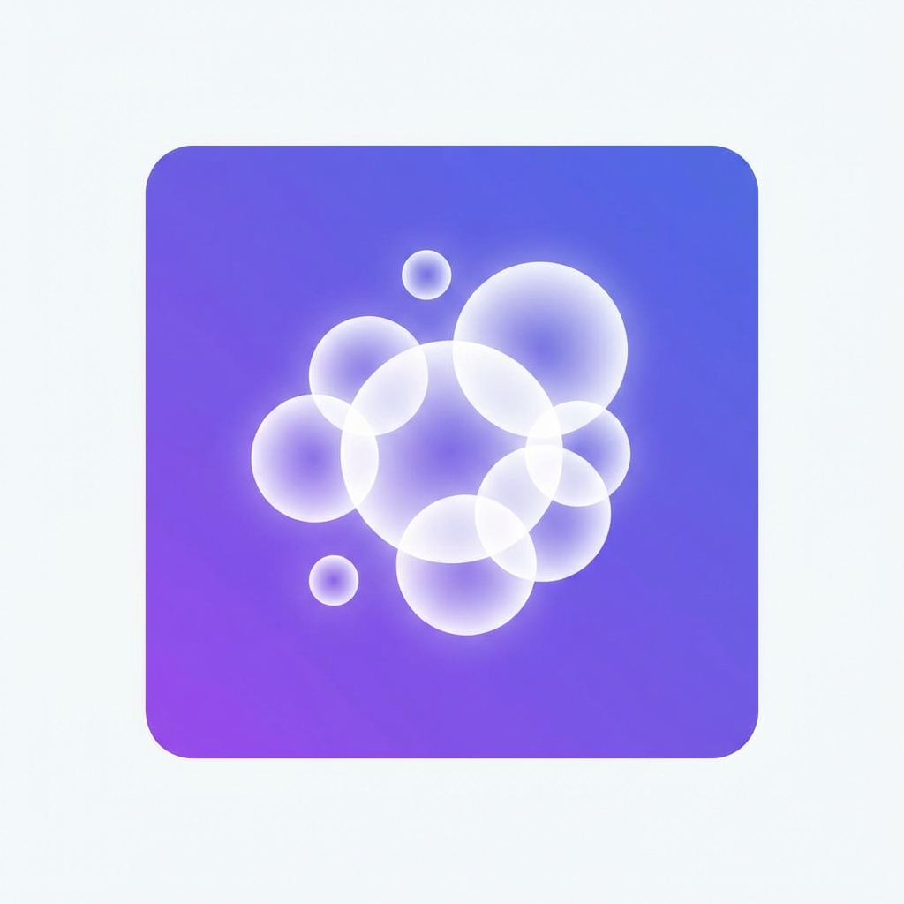
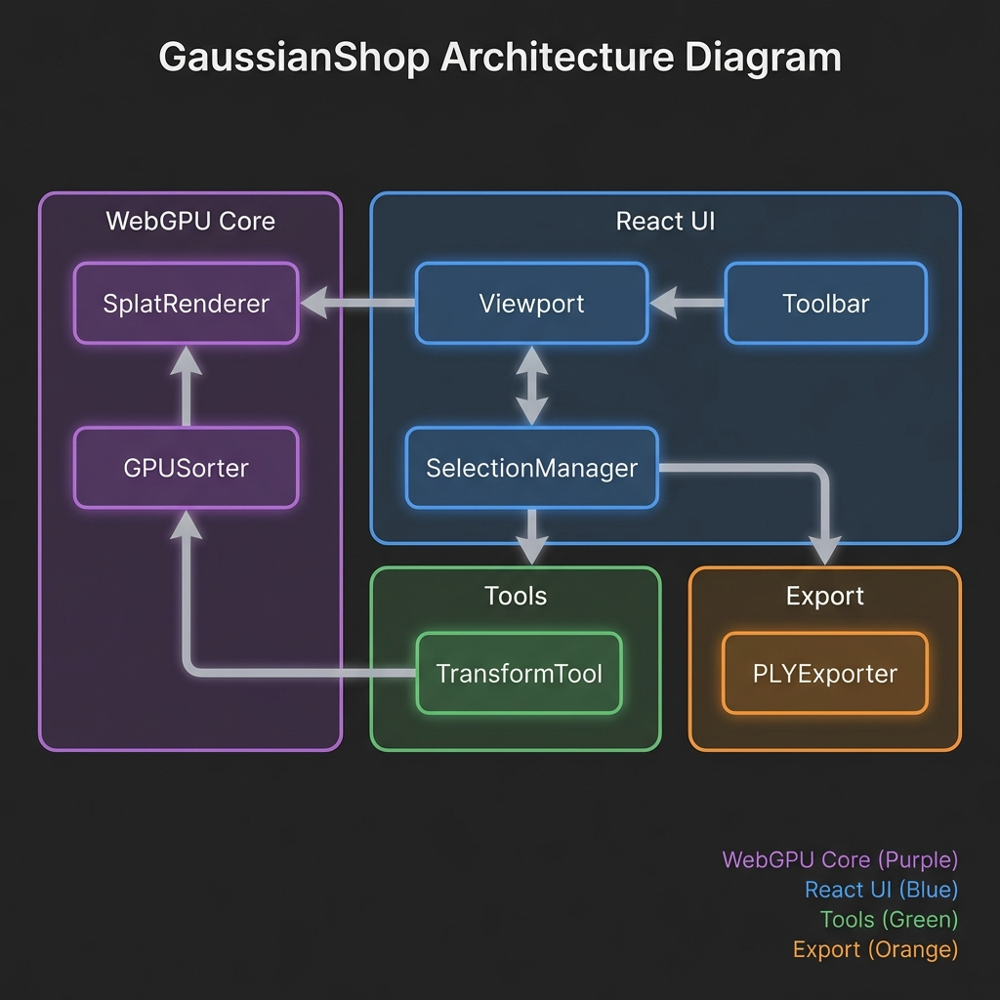

# GaussianShop

<p align="center">
  
</p>

<p align="center">
  <strong>🎨 Professional 3D Gaussian Splatting Editor</strong>
</p>

<p align="center">
  <a href="#features">Features</a> •
  <a href="#installation">Installation</a> •
  <a href="#usage">Usage</a> •
  <a href="#architecture">Architecture</a> •
  <a href="#contributing">Contributing</a>
</p>

---

## Overview

GaussianShop is a powerful, browser-based 3D Gaussian Splatting editor built with WebGPU. It provides professional-grade tools for viewing, editing, and exporting 3D Gaussian splat data with real-time global illumination effects.

### Key Highlights

- 🚀 **WebGPU Rendering** - Native GPU acceleration for 60+ FPS performance
- 🎨 **Full Editing Suite** - Select, transform, brush, and modify splats
- 💡 **Global Illumination** - SSAO, SSR, and volumetric lighting
- 📤 **Multi-Format Export** - PLY, SPLAT, OBJ, PNG, JPEG
- ⚡ **Optimized Pipeline** - GPU sorting, LOD, frustum culling

---

## Features

### 🎯 Core Editing Tools

| Tool | Description | Shortcut |
|------|-------------|----------|
| **Selection** | Click/box select Gaussians | `V` |
| **Transform** | Move, rotate, scale with gizmo | `G/R/S` |
| **Brush** | Paint/erase Gaussians | `B` |
| **Clone** | Duplicate selected splats | `Ctrl+D` |

### 💡 Global Illumination

| Effect | Description |
|--------|-------------|
| **SSAO** | Screen-space ambient occlusion |
| **SSR** | Screen-space reflections |
| **Volumetric** | Volumetric lighting and fog |
| **Light Probes** | Environment-based lighting |

### 📤 Export Formats

| Format | Extension | Description |
|--------|-----------|-------------|
| PLY Binary | `.ply` | Standard format, fastest |
| PLY ASCII | `.ply` | Human-readable |
| SPLAT | `.splat` | Compressed format |
| OBJ Mesh | `.obj` | Polygon mesh extraction |
| Image | `.png/.jpg` | Viewport screenshots |
| Project | `.gsp` | Full project with history |

### ⚡ Performance Optimizations

- **GPU Radix Sort** - Parallel depth sorting (10-100x faster)
- **Frustum Culling** - Skip off-screen Gaussians (30-50% improvement)
- **LOD System** - Distance-based detail reduction
- **Buffer Pooling** - Reduce allocation overhead
- **Pipeline Cache** - Reuse compiled GPU pipelines
- **Lazy Loading** - On-demand component loading

---

## Installation

### Prerequisites

- **Node.js** 18.0+ 
- **npm** or **pnpm**
- **Modern Browser** with WebGPU support (Chrome 113+, Edge 113+, Firefox Nightly)

### Quick Start

```bash
# Clone the repository
git clone https://github.com/yourusername/GaussianShop.git
cd GaussianShop

# Install dependencies
npm install

# Start development server
npm run dev
```

### Production Build

```bash
# Build for production
npm run build

# Preview production build
npm run preview
```

---

## Usage

### Opening Files

1. **Click "Open"** or press `Ctrl+O`
2. **Drag & Drop** .ply or .splat files onto the welcome screen
3. **Recent Files** are shown on the welcome screen

### Editing Workflow

1. **Select** Gaussians using box selection or click
2. **Transform** with the gizmo (move/rotate/scale)
3. **Adjust Properties** in the right panel
4. **Save Project** with `Ctrl+S` (.gsp format)
5. **Export** in your preferred format

### Keyboard Shortcuts

Press `?` to view all shortcuts, or see the status bar at the bottom.

| Category | Shortcuts |
|----------|-----------|
| File | `Ctrl+O` Open, `Ctrl+S` Save |
| Edit | `Ctrl+Z` Undo, `Ctrl+Y` Redo |
| Selection | `Ctrl+A` All, `Ctrl+D` Deselect |
| Transform | `G` Move, `R` Rotate, `S` Scale |
| View | `F` Focus, `H` Home |

---

## Architecture

<p align="center">
  
</p>

```
GaussianShop/
├── src/
│   ├── core/           # WebGPU rendering engine
│   │   ├── SplatRenderer.ts
│   │   ├── GPUSorter.ts
│   │   ├── FrustumCuller.ts
│   │   └── shaders/
│   ├── components/     # React UI components
│   │   ├── Viewport.tsx
│   │   ├── Toolbar.tsx
│   │   ├── Sidebar.tsx
│   │   └── ...
│   ├── tools/          # Editing tools
│   │   ├── SelectionManager.ts
│   │   ├── TransformTool.ts
│   │   └── BrushTool.ts
│   ├── lighting/       # GI system
│   │   ├── GlobalIllumination.ts
│   │   ├── SSAO.ts
│   │   └── SSR.ts
│   ├── export/         # Export formats
│   │   ├── PLYExporter.ts
│   │   ├── SplatExporter.ts
│   │   └── MeshExtractor.ts
│   └── scene/          # Scene management
│       ├── SceneGraph.ts
│       └── LayerManager.ts
├── public/
└── package.json
```

### Technology Stack

| Layer | Technology |
|-------|------------|
| Rendering | WebGPU + WGSL |
| UI Framework | React 18 |
| State Management | Zustand |
| Build Tool | Vite |
| Language | TypeScript |

---

## Requirements

### Browser Support

| Browser | Version | Status |
|---------|---------|--------|
| Chrome | 113+ | ✅ Full Support |
| Edge | 113+ | ✅ Full Support |
| Firefox | Nightly | ⚠️ Experimental |
| Safari | 18+ | ⚠️ Limited |

### System Requirements

- **GPU**: WebGPU-compatible (most modern GPUs)
- **RAM**: 4GB minimum, 8GB recommended
- **CPU**: Any modern multi-core processor

---

## Development

### Scripts

```bash
npm run dev      # Start development server
npm run build    # Build for production
npm run preview  # Preview production build
npm run lint     # Run ESLint
npm run test     # Run tests
```

### Environment

The project uses Vite with TypeScript. Configuration files:

- `vite.config.ts` - Vite configuration
- `tsconfig.json` - TypeScript configuration
- `.eslintrc.cjs` - ESLint rules

---

## Contributing

Contributions are welcome! Please read our contributing guidelines before submitting PRs.

1. Fork the repository
2. Create a feature branch (`git checkout -b feature/amazing`)
3. Commit changes (`git commit -m 'Add amazing feature'`)
4. Push to branch (`git push origin feature/amazing`)
5. Open a Pull Request

---

## License

MIT License - see [LICENSE](LICENSE) for details.

---

<p align="center">
  Made with ❤️ for the 3D Gaussian Splatting community
</p>
